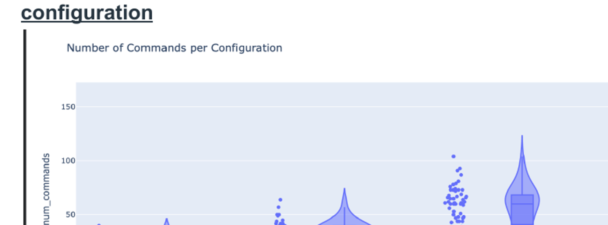

# SSH Honeypot Attacker Behavior Analysis

Cybersecurity research project investigating how the presence of sensitive decoy data influences attacker behavior in high-interaction SSH honeypot environments.

The experiment compared attacker activity across four controlled Linux honeypot configurations and analyzed whether increasingly sensitive data affected **attacker dwell time** and **depth of exploration**.

## Project Overview

The experiment used Linux containers configured as SSH honeypots and exposed them to real-world attack traffic.

Four experimental environments were used:

| Configuration | Decoy Data |
| --- | --- |
| Control | No meaningful files |
| Treatment 1 | Non-sensitive files |
| Treatment 2 | Sensitive/mixed decoy data |
| Treatment 3 | Sensitive decoy data |

Attacker activity was captured through authentication logs, command logging, and system activity monitoring.

Across the experiment, we observed:

- **30,080 total attack sessions**
- **11,748 unique attacker IP addresses**
- Four controlled honeypot configurations
- Command execution and session-duration measurements
- Real-world SSH attack traffic

## Research Question

**Does increasing the amount of sensitive information within a honeypot cause attackers to remain in the system longer or explore it more deeply?**

Two primary behavioral measurements were evaluated:

**Dwell Time** — how long an attacker remained active within the honeypot.

**Exploration Depth** — attacker interaction with the environment, particularly the number of commands executed.

## Experimental Architecture

The environment used **LXC Linux containers** to create isolated honeypot configurations.

The experimental workflow consisted of repeatedly:

1. Deploying or restoring a honeypot environment
2. Exposing the container to attack traffic
3. Monitoring SSH sessions and attacker commands
4. Collecting authentication and system logs
5. Calculating behavioral metrics
6. Restoring the environment to a clean baseline
7. Repeating the experiment

This recycling process allowed the environments to remain consistent between observation periods.

## Honeypot Automation

A Bash recycling script was used to automate much of the honeypot lifecycle.

The script handles:

- Terminating active SSH sessions
- Collecting authentication logs
- Collecting Snoopy command logs
- Capturing Bash command histories
- Recording file activity
- Calculating session metrics
- Restoring LXC containers from baseline snapshots
- Restarting logging infrastructure
- Reapplying network configuration

View the automation script:

[`scripts/honeypot-recycling.sh`](scripts/honeypot-recycling.sh)

## Statistical Analysis

The collected attack data was analyzed using Python to determine whether attacker behavior differed significantly between honeypot configurations.

The analysis included:

- Exploratory data analysis
- Distribution visualization
- Normality testing
- One-way ANOVA
- Tukey HSD post-hoc testing
- Kruskal-Wallis testing
- Dunn post-hoc comparisons
- Command-count analysis

The complete analysis notebook is available here:

[`analysis/honeypot-data-analysis.ipynb`](analysis/honeypot-data-analysis.ipynb)

## Results

### Exploration Depth

One of the clearest patterns appeared in the number of commands executed by attackers.



Command activity increased substantially across the experimental configurations, with environments containing more sensitive decoy information generally producing greater attacker interaction.

This suggests that while sensitive information may not necessarily cause attackers to remain connected longer, it can encourage **deeper exploration and greater command execution**.

### Dwell Time

Differences in session duration were also observed across configurations. However, the results did not show the expected progression where increasingly sensitive data consistently produced longer attacker sessions.

The dwell-time results therefore did **not strongly support the original sensitivity hypothesis**.

## Key Finding

The experiment produced an important distinction between two measures of attacker engagement:

> **Sensitive decoy data increased the depth of attacker exploration more consistently than it increased attacker dwell time.**

In other words, attackers did not necessarily remain connected longer when sensitive-looking information was present, but they tended to **interact more extensively with the environment**.

## Technologies

- Linux
- LXC Containers
- Bash
- SSH
- Snoopy Command Logging
- Python
- Jupyter Notebook
- Pandas
- Statistical Analysis
- Honeypot Security

## My Role

This project was completed collaboratively as part of a cybersecurity research course.

My contributions included work on the project's research and analysis, including the executive summary and background research, while also participating in the broader experimental investigation and interpretation of attacker behavior.

The project strengthened my experience working with cybersecurity experimentation, Linux environments, honeypot infrastructure, attacker telemetry, and data-driven security analysis.

## Repository Structure

```text
honeypot-attacker-behavior-analysis/
├── README.md
├── analysis/
│   ├── honeypot-data-analysis.ipynb
│   └── results-command-count.png
├── scripts/
│   └── honeypot-recycling.sh
└── docs/
    └── final-report.pdf
```

## Documentation

The full research report provides additional details about the experimental design, methodology, statistical testing, results, limitations, and conclusions.

[View the Final Research Report](docs/final-report.pdf)

## What I Learned

This project demonstrated how cybersecurity experimentation can combine **systems engineering and statistical analysis**.

Rather than relying only on attack counts, we examined behavioral signals such as session duration and command execution to better understand how attackers responded to different environments.

The project also provided practical experience with Linux containerization, automated environment recycling, security logging, experimental design, and analyzing large-scale real-world attack activity.
